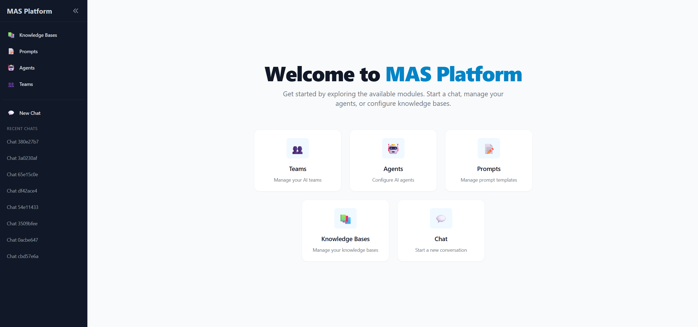
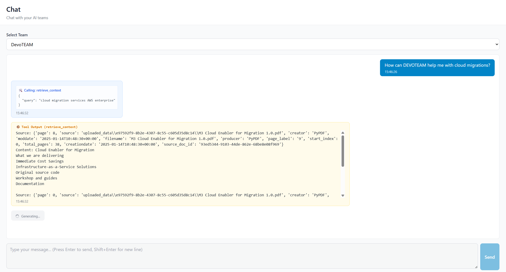
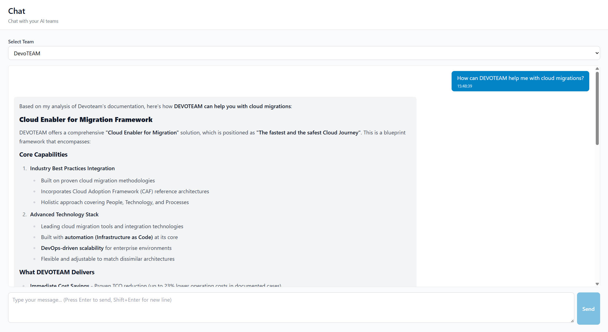
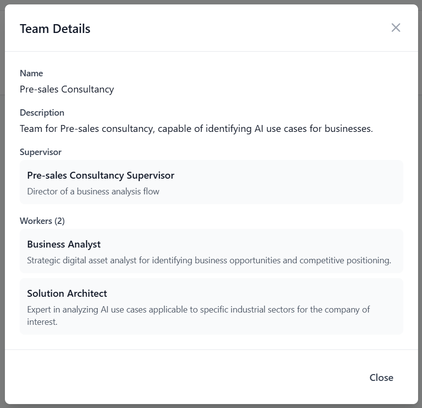

# MAS Platform (tesi-AOPaaS)

Welcome to the **MAS Platform**! This is the Thesis Project by Gabriele Richiusa focused on a cloud-based Agent Orchestration service. 
Our main goal is to democratize the power of Artificial Intelligence by enabling **non-technical users** to effortlessly create, manage, and interact with complex **Multi-Agent Systems (MAS)** through an intuitive, No-Code approach.

---
## 🏗️ Architecture & Framework
The platform is designed to be highly modular and scalable, built upon modern technologies to ensure a seamless experience:
- **Core Engine (Backend)**: Powered by *Python* and *FastAPI* to handle high-performance asynchronous operations and orchestration logic securely.
- **LLM Integrations**: Dynamically supports top-tier providers like *OpenAI*, *AWS Bedrock* (Anthropic Claude, Meta LLaMA), *Azure*, and local execution via *Ollama*.
- **Memory & Vector Database**: Utilizes *PostgreSQL* with the `pgvector` extension to give agents long-term memory and retrieval-augmented generation (RAG) capabilities.
- **User Interface (Frontend)**: A lightning-fast, reactive single-page application built with *React* and *Vite*.
---
## 🖥️ Platform Showcase
The platform's frontend abstracts away the underlying code complexity, providing a sleek interface where users can visually build and converse with their AI systems.
### 🏠 The Homepage (Agent Dashboard)
From the main dashboard, users can oversee their entire fleet of AI personas, knowledge bases, and available tools. The No-Code builder empowers anyone to configure new agents with distinct prompt behaviors and skill sets in seconds.


*The centralized control panel where non-technical users can design and monitor their AI agents.*

### 💬 Intelligent Chat Interface
Once an agent or a team is configured, users can collaborate with them through a rich chat interface. The system supports dynamic streaming responses and transparently shows when an agent is using external tools (like Web Search or File Retrieval) to formulate its answers.


*Real-time streaming chat interface showing an agent actively using its configured tools to assist the user.*


### 🤖 Multi-Agent Teams
The true power of the MAS Platform lies in group orchestration. Users can connect multiple specialized agents—each with specific roles and tools—into a unified **Team**. The platform coordinates the dialogue between these agents, allowing them to collaborate, debate, and solve complex tasks automatically before presenting the final result to the user.


*A visual representation of multiple agents collaborating within a team setup to tackle a multi-step objective.*

## Prerequisites
- [Docker](https://www.docker.com/) and Docker Compose
- (Optional) Python 3.12+ and Node.js 18+ if you wish to run the platform locally without Docker

## Quick Start Guide

### 1. Clone/Download the repository
After cloning (or fetching) the repository from GitHub, navigate to the project directory:
```bash
git clone https://github.com/r-gab01/MAS_Platform.git
cd MAS_Platform
```

### 2. Backend Configuration and Environment Variables
The backend requires an `.env` file to connect to various providers (Azure, AWS, local database, Ollama, etc.).

1. Copy the example environment file:
   ```bash
   # From the project root, navigate to the app folder and copy the environment file
   cd app
   cp example.env .env
   # or on Windows: copy example.env .env
   ```
2. Open the newly created `app/.env` file and fill in the necessary credentials (e.g., API keys for various LLMs, Tavily keys). If you want to test a local LLM via Ollama, remember to set `OLLAMA_BASE_URL=http://host.docker.internal:11434` so that the Docker container can reach the host machine.
3. Return to the project root:
   ```bash
   cd ..
   ```

### 3. Start the Platform via Docker
Run docker-compose from the **root** of the project to build and start the entire infrastructure (Database, Backend API, and Frontend web client):
```bash
docker-compose up --build -d
```
- The **Frontend Web Client** will be accessible at: `http://localhost:3000`
- The **APIs (Backend)** will be listening on: `http://localhost:8000`
- The documentation (Swagger) will be available at: `http://localhost:8000/docs`

*(If you prefer manual setup without Docker, check the specific folders for their traditional python/npm start scripts).*
